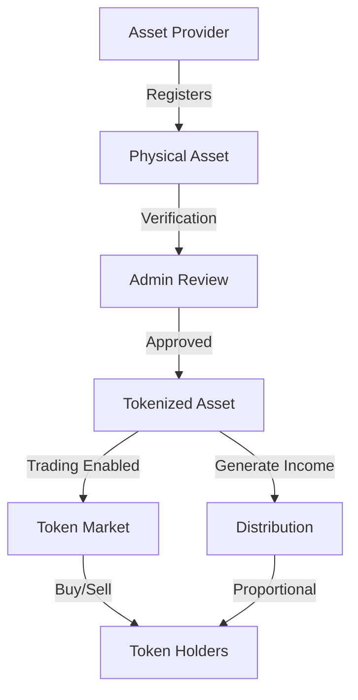

# ChainMint Asset Tokenization Platform

A blockchain-based platform for tokenizing physical assets into tradeable digital shares on the Stacks blockchain.

## Overview

ChainMint enables the conversion of physical assets (real estate, fine art, collectibles, commodities) into digital tokens representing fractional ownership. The platform provides:

- Secure asset registration and verification
- Fractional ownership through tokenization
- Trading capabilities for asset tokens
- Asset documentation and provenance tracking
- Income distribution for revenue-generating assets

## Architecture

The platform is built around a core smart contract that manages asset registration, tokenization, and trading. Here's how the system works:



Core components:
- Asset Provider Registry: Tracks verified asset providers
- Asset Registry: Stores asset details and verification status
- Token Holdings: Manages ownership of asset tokens
- Trading Controls: Enables/disables trading per asset
- Income Distribution: Handles revenue sharing among token holders

## Contract Documentation

### chainmint-core.clar

The main contract managing all platform functionality.

#### Key Features:
- Asset provider registration and verification
- Physical asset registration and tokenization
- Token transfer and trading controls
- Asset valuation updates
- Income distribution to token holders

#### Access Control:
- Admin: Can verify providers and assets
- Asset Providers: Can register assets and control trading
- Token Holders: Can transfer owned tokens
- Public: Can view asset and provider information

## Getting Started

### Prerequisites
- Clarinet
- Stacks blockchain wallet
- Node.js environment

### Installation
1. Clone the repository
2. Install dependencies
3. Deploy contracts using Clarinet

### Basic Usage

1. Register as an asset provider:
```clarity
(contract-call? .chainmint-core register-provider "Provider Name")
```

2. Register an asset (verified providers only):
```clarity
(contract-call? .chainmint-core register-asset 
    "Asset Name"
    "Description"
    "Asset Type"
    "Location"
    u1000000 ;; valuation
    u1000    ;; total supply
    "ipfs://documentation-uri"
)
```

3. Transfer tokens:
```clarity
(contract-call? .chainmint-core transfer 
    asset-id
    u10      ;; amount
    recipient-address
)
```

## Function Reference

### Administrative Functions
- `set-contract-admin`: Change contract administrator
- `verify-provider`: Approve an asset provider
- `verify-asset`: Approve a registered asset

### Provider Functions
- `register-provider`: Register as an asset provider
- `register-asset`: Register a new physical asset
- `toggle-trading-lock`: Enable/disable trading for an asset
- `update-asset-valuation`: Update asset value
- `update-documentation-uri`: Update asset documentation
- `distribute-income`: Distribute income to token holders

### Public Functions
- `transfer`: Transfer tokens between addresses
- `get-asset`: View asset details
- `get-provider`: View provider details
- `get-balance`: Check token balance
- `get-total-supply`: Get asset total supply

## Development

### Testing
Run tests using Clarinet:
```bash
clarinet test
```

### Local Development
1. Start Clarinet console:
```bash
clarinet console
```

2. Deploy contracts:
```bash
clarinet deploy
```

## Security Considerations

### Limitations
- Asset tokens are not transferable until verified by admin
- Trading must be explicitly enabled by asset provider
- Income distribution calculations happen on-chain, but actual transfers are off-chain

### Best Practices
- Always verify provider identity before registration approval
- Maintain accurate off-chain documentation
- Regular audits of asset valuations
- Careful review of documentation URIs
- Monitor trading patterns for suspicious activity